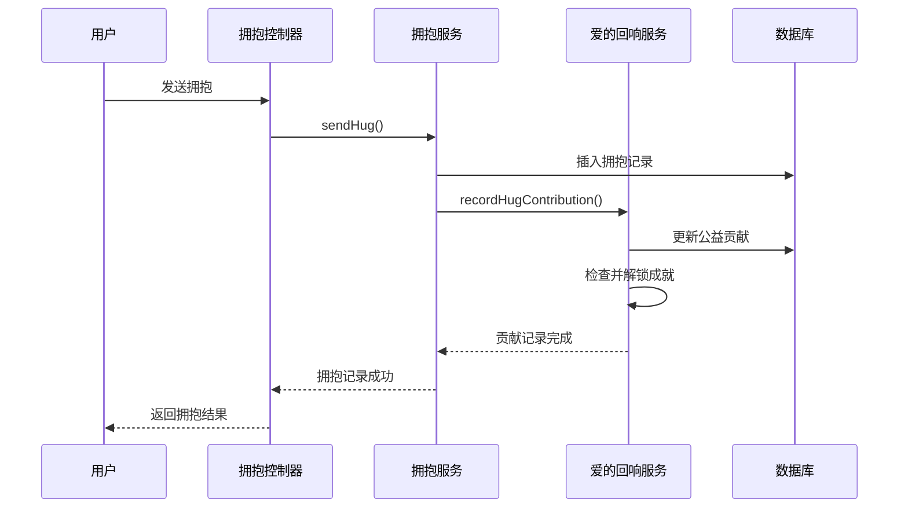

# 爱的回响 · 双向温暖闭环功能说明

## 📋 功能概述

本次更新为"拥抱妈妈·爱在平安"项目新增了**爱的回响 · 双向温暖闭环**核心功能，包括：

1. **妈妈端回复功能** - 双向情感交流
2. **年度爱的报告** - 数据可视化呈现
3. **公益联动系统** - 温暖传递可视化

---

## 🗂️ 新增文件清单

### 1. 数据库表结构
**文件**: `database/schema.sql`

新增6张数据表：
- `hm_mother_reply` - 妈妈回复表
- `hm_annual_report` - 年度报告表
- `hm_welfare_contribution` - 公益贡献记录表
- `hm_welfare_achievement` - 公益成就表
- `hm_welfare_story` - 公益故事表
- `hm_welfare_platform_stats` - 平台公益统计表

### 2. 实体类（Entity）
位置: `src/main/java/com/hugmom/back/entity/`

- `MotherReply.java` - 妈妈回复实体
- `AnnualReport.java` - 年度报告实体
- `WelfareContribution.java` - 公益贡献实体
- `WelfareAchievement.java` - 公益成就实体
- `WelfareStory.java` - 公益故事实体
- `WelfarePlatformStats.java` - 平台统计实体

### 3. 数据访问层（Mapper）
**接口位置**: `src/main/java/com/hugmom/back/mapper/`
- `MotherReplyMapper.java`
- `AnnualReportMapper.java`
- `WelfareMapper.java`

**XML映射位置**: `src/main/resources/mapper/`
- `MotherReplyMapper.xml`
- `AnnualReportMapper.xml`
- `WelfareMapper.xml`

### 4. 服务层（Service）
**接口**: `src/main/java/com/hugmom/back/service/EchoService.java`

**实现**: `src/main/java/com/hugmom/back/service/impl/EchoServiceImpl.java`

### 5. 控制器层（Controller）
**文件**: `src/main/java/com/hugmom/back/controller/EchoController.java`

### 6. 集成改动
**修改文件**: `src/main/java/com/hugmom/back/service/impl/HugServiceImpl.java`
- 在发送拥抱时自动记录公益贡献

---

## 🔌 API接口列表

### 一、妈妈回复相关

#### 1. 发送妈妈回复
```
POST /api/echo/mother-reply
```
**请求体**:
```json
{
  "originalMessageId": "hug_20260201_001",
  "replyType": "text",  // voice | text | emoji
  "textContent": "妈妈也想你了，注意保暖！"
}
```

**响应**:
```json
{
  "code": 200,
  "success": true,
  "msg": "回复发送成功",
  "data": {
    "replyId": "reply_20260204_abc123",
    "aiTranscript": "妈妈也想你了，注意保暖！",
    "sendTime": "2026-02-04T10:30:00",
    "emotion": "warm"
  }
}
```

#### 2. 获取妈妈回复列表
```
GET /api/echo/replies/{memberId}
```

#### 3. 标记回复为已读
```
PUT /api/echo/reply/{replyId}/read
```

#### 4. 获取未读回复数量
```
GET /api/echo/unread-count
```

---

### 二、年度报告相关

#### 1. 生成年度报告
```
POST /api/echo/annual-report
```
**请求体**:
```json
{
  "year": 2026  // 可选，默认当前年份
}
```

**响应**:
```json
{
  "code": 200,
  "success": true,
  "msg": "报告生成成功",
  "data": {
    "reportId": "report_2026_xyz789",
    "year": 2026,
    "summary": {
      "totalHugs": 36,
      "totalSafetyMessages": 48,
      "totalDistance": 3600,
      "warmDays": 365,
      "mostActiveMonth": "12月",
      "favoriteMessage": "妈妈我平安，您放心"
    },
    "memberStats": [...],
    "milestones": [...],
    "publicWelfare": {
      "totalContribution": 0.036,
      "helpedFamilies": 36
    }
  }
}
```

#### 2. 获取历史报告列表
```
GET /api/echo/annual-reports
```

#### 3. 获取报告详情
```
GET /api/echo/annual-report/{reportId}
```

#### 4. 分享年度报告
```
POST /api/echo/annual-report/{reportId}/share
```

---

### 三、公益联动相关

#### 1. 获取平台公益统计
```
GET /api/echo/public-welfare/stats
```

**响应**:
```json
{
  "code": 200,
  "success": true,
  "data": {
    "totalPlatformHugs": 10000,
    "totalWelfareValue": 100.00,
    "helpedFamiliesCount": 10,
    "currentMonthHugs": 500,
    "realtimeContributors": 20,
    "milestones": [
      {
        "value": 10000,
        "description": "首个万次拥抱",
        "reachedAt": "2026-02-01T00:00:00"
      }
    ]
  }
}
```

#### 2. 获取个人公益贡献
```
GET /api/echo/public-welfare/my-contribution
```

**响应**:
```json
{
  "code": 200,
  "success": true,
  "data": {
    "userId": "user_test",
    "totalContribution": 0.036,
    "rank": 5,
    "totalHugs": 36,
    "contributionHistory": [...],
    "achievements": [
      {
        "achievementId": "achievement_love_sender",
        "name": "爱心传递者",
        "description": "发送了10次温暖拥抱",
        "unlockedAt": "2026-01-15T10:00:00",
        "icon": "icon_love_sender.png"
      }
    ]
  }
}
```

#### 3. 获取公益故事墙
```
GET /api/echo/public-welfare/stories?page=1&pageSize=10
```

---

## 🔄 业务流程

### 1. 拥抱公益贡献自动记录流程



### 2. 成就解锁机制

- **爱心传递者**: 10次拥抱
- **温暖守护者**: 50次拥抱
- **公益使者**: 100次拥抱

每次发送拥抱时自动检查，满足条件即解锁。

---

## 📊 核心算法说明

### 1. 公益贡献值计算
```
每次拥抱贡献值 = 0.001
累计贡献值 = 拥抱次数 × 0.001
帮助家庭数 = 累计贡献值 × 1000
```

### 2. 情感标签识别（简化版）
```java
if (content.contains("想你") || content.contains("爱你")) {
    return "warm";  // 温暖
} else if (content.contains("注意") || content.contains("保重")) {
    return "caring";  // 关心
} else if (content.contains("棒") || content.contains("优秀")) {
    return "proud";  // 骄傲
}
```

### 3. 用户贡献排名算法
使用SQL子查询计算排名：
```sql
SELECT COUNT(*) + 1 AS rank
FROM (
    SELECT user_id, SUM(contribution_value) AS total_contribution
    FROM hm_welfare_contribution
    GROUP BY user_id
) AS user_contributions
WHERE total_contribution > (当前用户的累计贡献值)
```

---

## 🛠️ 部署说明

### 1. 数据库初始化
```bash
# 执行数据库脚本
mysql -u root -p hug_mom < database/schema.sql
```

### 2. 后端启动
```bash
# 确保依赖完整
mvn clean install

# 启动应用
java -jar target/back-0.0.1-SNAPSHOT.jar
```

### 3. 测试接口
```bash
# 测试公益统计接口
curl -X GET "http://localhost:8080/api/echo/public-welfare/stats" \
  -H "Authorization: Bearer YOUR_TOKEN"
```

---

## ⚠️ 注意事项

### 1. AI功能占位实现
以下功能为占位实现，生产环境需对接真实服务：
- **语音转文字**: 当前为mock实现，需对接腾讯云ASR服务
- **情感识别**: 当前为关键词匹配，可升级为NLP情感分析

### 2. 性能优化建议
- 公益统计数据建议使用Redis缓存，减少数据库查询
- 年度报告生成为重操作，建议异步处理
- 贡献排名计算建议每日定时更新缓存

### 3. 伦理守护
- 已故成员禁止拥抱功能在HugService中严格校验
- 所有AI处理需用户授权（前端实现）
- 公益故事已做匿名化处理

---

## 🎯 功能亮点

✅ **双向温暖闭环** - 妈妈可以回复，增强情感连接  
✅ **数据可视化** - 年度报告让爱看得见  
✅ **公益透明化** - 每次拥抱都在帮助他人  
✅ **成就激励系统** - 让温暖传递更有动力  
✅ **伦理优先设计** - 所有功能符合AI向善原则  

---

## 📞 技术支持

如有问题，请联系：
- 后端开发：HugMom Team
- 项目文档：`/项目书/功能书.md`
- 技术栈文档：`/项目书/技术栈.md`

---

**版本**: v1.0.0  
**更新日期**: 2026-02-04  
**AI向善声明**: 本功能遵循《拥抱妈妈伦理规范》，所有技术服务于真情传递
