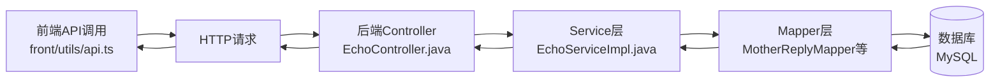

# 爱的回响 · 前后端接口对照表

## 📋 说明
本文档展示前端API调用函数与后端Controller接口的完整对照关系，确保前后端联调顺利。

---

## 1️⃣ 妈妈回复功能

### 1.1 发送妈妈回复

| 项目 | 内容 |
|------|------|
| **前端函数** | `sendMotherReply(data: SendMotherReplyRequest)` |
| **前端文件** | `front/utils/api.ts:166` |
| **后端接口** | `POST /api/echo/mother-reply` |
| **后端方法** | `EchoController.sendMotherReply()` |
| **后端文件** | `back/src/main/java/com/hugmom/back/controller/EchoController.java:31` |
| **Service方法** | `EchoService.sendMotherReply()` |

**请求参数对照**:
```typescript
// 前端请求
interface SendMotherReplyRequest {
  originalMessageId: string
  replyType: 'voice' | 'text' | 'emoji'
  voiceUrl?: string
  textContent?: string
}
```

```java
// 后端接收
@RequestBody Map<String, Object> params
- originalMessageId: String
- replyType: String
- voiceUrl: String (可选)
- textContent: String (可选)
```

---

### 1.2 获取妈妈回复列表

| 项目 | 内容 |
|------|------|
| **前端函数** | `getMotherReplies(memberId: string)` |
| **前端文件** | `front/utils/api.ts:179` |
| **后端接口** | `GET /api/echo/replies/{memberId}` |
| **后端方法** | `EchoController.getMotherReplies()` |
| **返回类型** | `List<MotherReply>` |

---

### 1.3 标记回复为已读

| 项目 | 内容 |
|------|------|
| **前端函数** | `markReplyAsRead(replyId: string)` |
| **前端文件** | `front/utils/api.ts:187` |
| **后端接口** | `PUT /api/echo/reply/{replyId}/read` |
| **后端方法** | `EchoController.markReplyAsRead()` |

---

## 2️⃣ 年度报告功能

### 2.1 生成年度报告

| 项目 | 内容 |
|------|------|
| **前端函数** | `generateAnnualLoveReport(year?: number)` |
| **前端文件** | `front/utils/api.ts:195` |
| **后端接口** | `POST /api/echo/annual-report` |
| **后端方法** | `EchoController.generateAnnualReport()` |
| **Service方法** | `EchoService.generateAnnualReport()` |
| **返回类型** | `AnnualReport` |

**数据结构对照**:
```typescript
// 前端类型定义 (front/types/index.d.ts)
interface AnnualLoveReport {
  reportId: string
  year: number
  userId: string
  generateTime: string
  summary: {
    totalHugs: number
    totalSafetyMessages: number
    totalDistance: number
    warmDays: number
    mostActiveMonth: string
    favoriteMessage: string
  }
  // ...更多字段
}
```

```java
// 后端实体类 (back/.../entity/AnnualReport.java)
public class AnnualReport {
    private String reportId;
    private String userId;
    private Integer year;
    private Integer totalHugs;
    private Integer totalSafetyMessages;
    private BigDecimal totalDistance;
    private Integer warmDays;
    private String mostActiveMonth;
    private String favoriteMessage;
    // ...更多字段
}
```

---

### 2.2 获取历史报告列表

| 项目 | 内容 |
|------|------|
| **前端函数** | `getAnnualReports()` |
| **前端文件** | `front/utils/api.ts:202` |
| **后端接口** | `GET /api/echo/annual-reports` |
| **后端方法** | `EchoController.getAnnualReports()` |
| **返回类型** | `List<AnnualReport>` → `AnnualReportSummary[]` |

---

### 2.3 获取报告详情

| 项目 | 内容 |
|------|------|
| **前端函数** | `getAnnualReportDetail(reportId: string)` |
| **前端文件** | `front/utils/api.ts:210` |
| **后端接口** | `GET /api/echo/annual-report/{reportId}` |
| **后端方法** | `EchoController.getAnnualReportDetail()` |

---

### 2.4 分享年度报告

| 项目 | 内容 |
|------|------|
| **前端函数** | `shareAnnualReport(reportId: string)` |
| **前端文件** | `front/utils/api.ts:218` |
| **后端接口** | `POST /api/echo/annual-report/{reportId}/share` |
| **后端方法** | `EchoController.shareAnnualReport()` |
| **返回数据** | `{ posterUrl, shareCode, expiresIn }` |

---

## 3️⃣ 公益联动功能

### 3.1 获取平台公益统计

| 项目 | 内容 |
|------|------|
| **前端函数** | `getPublicWelfareStats()` |
| **前端文件** | `front/utils/api.ts:230` |
| **后端接口** | `GET /api/echo/public-welfare/stats` |
| **后端方法** | `EchoController.getPublicWelfareStats()` |
| **返回类型** | `PublicWelfareStats` |

**返回数据结构**:
```typescript
// 前端
interface PublicWelfareStats {
  totalPlatformHugs: number
  totalWelfareValue: number
  helpedFamiliesCount: number
  currentMonthHugs: number
  realtimeContributors: number
  milestones: Array<{
    value: number
    description: string
    reachedAt?: string
  }>
}
```

```json
// 后端返回
{
  "totalPlatformHugs": 10000,
  "totalWelfareValue": 100.00,
  "helpedFamiliesCount": 10,
  "currentMonthHugs": 500,
  "realtimeContributors": 20,
  "milestones": [...]
}
```

---

### 3.2 获取个人公益贡献

| 项目 | 内容 |
|------|------|
| **前端函数** | `getMyWelfareContribution()` |
| **前端文件** | `front/utils/api.ts:237` |
| **后端接口** | `GET /api/echo/public-welfare/my-contribution` |
| **后端方法** | `EchoController.getMyWelfareContribution()` |
| **返回类型** | `MyWelfareContribution` |

---

### 3.3 获取公益故事墙

| 项目 | 内容 |
|------|------|
| **前端函数** | `getWelfareStories(page: number, pageSize: number)` |
| **前端文件** | `front/utils/api.ts:245` |
| **后端接口** | `GET /api/echo/public-welfare/stories?page={page}&pageSize={pageSize}` |
| **后端方法** | `EchoController.getWelfareStories()` |
| **返回类型** | `WelfareStoriesResponse` |

---

## 🔄 数据流转示意图



---

## 📊 数据库表与实体类对照

| 数据库表 | 实体类 | 前端类型 | 用途 |
|---------|--------|---------|------|
| `hm_mother_reply` | `MotherReply` | `MotherReply` | 妈妈回复数据 |
| `hm_annual_report` | `AnnualReport` | `AnnualLoveReport` | 年度报告数据 |
| `hm_welfare_contribution` | `WelfareContribution` | 含在`MyWelfareContribution` | 个人贡献记录 |
| `hm_welfare_achievement` | `WelfareAchievement` | 含在`MyWelfareContribution` | 成就数据 |
| `hm_welfare_story` | `WelfareStory` | `WelfareStory` | 公益故事 |
| `hm_welfare_platform_stats` | `WelfarePlatformStats` | `PublicWelfareStats` | 平台统计 |

---

## 🔐 认证机制

所有接口均需要携带JWT Token：

```typescript
// 前端 (front/utils/request.ts)
headers: {
  'Authorization': `Bearer ${token}`
}
```

```java
// 后端 (TokenInterceptor.java)
String userId = (String) request.getAttribute("userId");
// 从token中解析出的用户ID会自动注入到request中
```

---

## ⚡ 调试技巧

### 前端调试
```typescript
// 在 front/utils/api.ts 中添加日志
console.log('调用接口:', '/api/echo/mother-reply', data)
```

### 后端调试
```java
// 在 EchoController 中查看日志
log.info("妈妈回复 - 用户:{}, 参数:{}", userId, params);
```

### 数据库调试
```sql
-- 查看妈妈回复数据
SELECT * FROM hm_mother_reply ORDER BY receive_time DESC LIMIT 10;

-- 查看公益贡献
SELECT user_id, SUM(contribution_value) as total 
FROM hm_welfare_contribution 
GROUP BY user_id 
ORDER BY total DESC;
```

---

## 🧪 接口测试示例

### 使用curl测试

```bash
# 1. 发送妈妈回复
curl -X POST "http://localhost:8080/api/echo/mother-reply" \
  -H "Content-Type: application/json" \
  -H "Authorization: Bearer YOUR_TOKEN" \
  -d '{
    "originalMessageId": "hug_20260204_001",
    "replyType": "text",
    "textContent": "妈妈也想你了！"
  }'

# 2. 生成年度报告
curl -X POST "http://localhost:8080/api/echo/annual-report" \
  -H "Content-Type: application/json" \
  -H "Authorization: Bearer YOUR_TOKEN" \
  -d '{"year": 2026}'

# 3. 获取公益统计
curl -X GET "http://localhost:8080/api/echo/public-welfare/stats" \
  -H "Authorization: Bearer YOUR_TOKEN"
```

---

## 📝 注意事项

### 1. 数据类型差异
- 前端使用 `string` 表示时间，后端使用 `LocalDateTime`
- 前端使用 `number` 表示金额，后端使用 `BigDecimal`
- 需要在序列化/反序列化时注意格式转换

### 2. 枚举值对齐
```typescript
// 前端
replyType: 'voice' | 'text' | 'emoji'
emotion: 'warm' | 'caring' | 'proud'
```

```java
// 后端（字符串常量）
"voice" / "text" / "emoji"
"warm" / "caring" / "proud"
```

### 3. 分页参数
前端和后端都使用：
- `page`: 页码（从1开始）
- `pageSize`: 每页数量

---

## ✅ 联调检查清单

- [ ] 前端类型定义与后端返回数据结构一致
- [ ] 所有枚举值前后端对齐
- [ ] 时间格式统一为ISO 8601
- [ ] Token认证正常工作
- [ ] 错误码处理完整
- [ ] 数据库表已创建
- [ ] Mapper XML配置正确
- [ ] Service层事务配置正确

---

**版本**: v1.0.0  
**更新日期**: 2026-02-04  
**维护团队**: HugMom Full Stack Team
