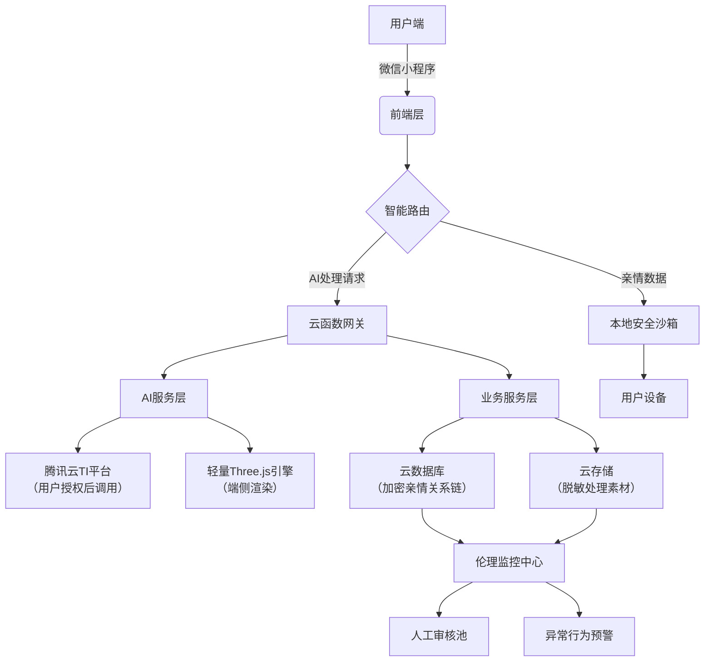
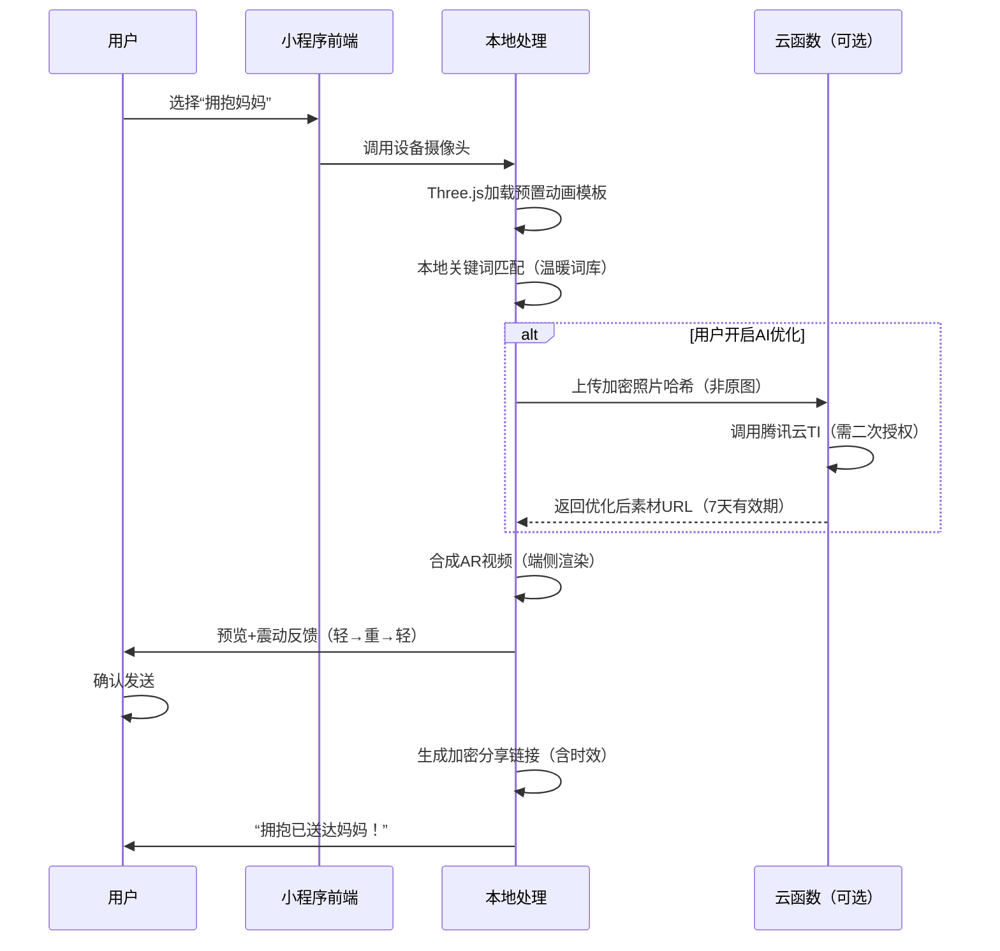
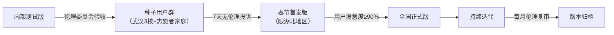

# 拥抱妈妈·爱在平安微信小程序
## 全栈技术实施方案（AI向善 · 轻量化 · 伦理优先）

**核心理念**：技术隐形于爱，伦理嵌入代码，让每一行实现都承载温度与责任

---

## 一、整体体系架构（分层解耦 · 安全可控）



### 架构亮点

* **数据双轨制**：亲情关系链存云端（加密），原始照片/语音仅设备端处理
* **AI调用熔断机制**：用户关闭授权时，自动切换至纯前端轻量方案
* **伦理监控闭环**：所有AI调用日志实时同步至伦理监控中心，异常行为自动冻结

---

## 二、详细模块设计方案

### 1. 核心数据模型（云数据库 Schema）

```javascript
// users（用户表）
{
  "_id": "openid_xxx",
  "nickName": "小明",
  "familyMembers": [
    {
      "memberId": "mem_001",
      "name": "妈妈",
      "status": "alive", // alive/deceased
      "photoHash": "sha256_xxx", // 仅存哈希值，原始图在设备端
      "birthday": "1965-03-08",
      "lastHugTime": "2026-01-30T14:20:00Z"
    }
  ],
  "settings": {
    "emotionHighlight": true, // 用户自主开关
    "vibration": true,
    "theme": "warm"
  }
}

// memorialSpace（纪念空间 - 仅存元数据）
{
  "memberId": "mem_002",
  "creatorId": "openid_xxx",
  "createdAt": "2025-12-01T10:00:00Z",
  "lastVisit": "2026-01-30T09:15:00Z",
  "entries": [ // 仅存文字摘要哈希
    {"date": "2026-01-30", "hash": "sha256_xxx"}
  ]
}

```

### 2. 虚拟拥抱核心流程（端侧优先）



### 3. 伦理安全设计嵌入点

| 模块 | 伦理嵌入设计 | 技术实现 |
| --- | --- | --- |
| **照片处理** | 用户二次授权弹窗 | `wx.authorize({scope: 'scope.writePhotosAlbum'})` + 自定义确认页 |
| **纪念模式** | 禁用动态生成 | 云函数校验：若 `status=deceased`，拒绝调用AR生成接口 |
| **数据留存** | 7天自动清理 | 云函数定时触发：`db.collection('tempAssets').where({expireAt: db.command.lt(new Date())}).remove()` |
| **情感提示** | 用户主权开关 | `settings.emotionHighlight` 字段控制前端高亮逻辑 |

---

## 三、技术选型与工具链（轻量 · 合规 · 高效）

| 层级 | 技术栈 | 选型理由 | 伦理保障 |
| --- | --- | --- | --- |
| **前端** | 微信小程序原生框架 + TypeScript | 官方生态完善，审核友好 | 通过微信安全检测 |
| **AR引擎** | Three.js r158（精简版 180KB） | 轻量级3D渲染，支持低端机 | 无用户数据采集 |
| **UI组件** | Vant WeUI + 自定义情感组件库 | 符合微信设计规范 | 无障碍模式支持 |
| **后端** | 腾讯云开发 CloudBase（Node.js 18） | 无缝对接小程序，免运维 | 数据加密传输（TLS 1.3） |
| **AI服务** | 腾讯云TI平台（图像处理） | 合规资质齐全，支持私有化部署 | 用户授权+数据脱敏 |
| **伦理监控** | 自研监控模块 + 人工审核池 | 实时拦截高风险操作 | 伦理委员会可审计日志 |
| **开发工具** | VS Code + Git + Jenkins（CI/CD） | 标准化流程，版本可控 | 代码伦理审查插件 |

**关键取舍**：

* ❌ **不采用** TensorFlow.js端侧模型（包体积大、低端机卡顿）
* ✅ **采用** “预置关键词库+用户自定义”替代情感AI（开发量<3人日，零伦理风险）
* ✅ 老照片修复仅当用户**主动点击**“优化照片” 时调用云API（非自动触发）

---

## 四、开发实现关键代码示例

### 1. 伦理优先的AI调用（云函数示例）

```javascript
// cloud/functions/processPhoto/index.js
const cloud = require('wx-server-sdk')
cloud.init({ env: cloud.DYNAMIC_CURRENT_ENV })

exports.main = async (event, context) => {
  // 1. 伦理校验：是否纪念模式成员？
  const member = await db.collection('familyMembers')
    .doc(event.memberId).get()
  if (member.data.status === 'deceased') {
    throw new Error('纪念模式成员禁止调用图像优化')
  }

  // 2. 用户授权校验（前端传入授权token）
  if (!event.userAuthorized) {
    throw new Error('需用户明确授权')
  }

  // 3. 调用腾讯云TI（仅传加密哈希，非原图）
  const tiResult = await callTiPlatform({
    imageHash: event.imageHash,
    service: 'photo_restoration'
  })

  // 4. 记录伦理日志（供监控中心审计）
  await logEthicsAudit({
    action: 'photo_restoration',
    userId: event.userId,
    timestamp: new Date(),
    consent: true
  })

  return { url: tiResult.secureUrl, expiresIn: 604800 } // 7天有效期
}

```

### 2. 端侧温暖词高亮（前端核心逻辑）

```typescript
// pages/hug/utils/emotionHighlight.ts
const WARM_WORDS = [
  '开心', '平安', '加油', '想你', '温暖', '幸福',
  '吃饱了', '考好了', '回家', '妈妈' // 亲情场景特有词
];

export const highlightWarmWords = (text: string): string => {
  // 仅当用户开启设置时生效
  const settings = wx.getStorageSync('appSettings');
  if (!settings?.emotionHighlight) return text;

  return text.replace(
    new RegExp(`(${WARM_WORDS.join('|')})`, 'g'),
    '<span class="warm-highlight">$1</span>'
  );
};
// 使用示例（WXML中）
// <text wx:if="{{showHighlight}}" decode="true">{{highlightedText}}</text>

```

### 3. 多模态震动反馈（情感化交互）

```javascript
// utils/vibration.js
export const triggerHugVibration = () => {
  // 模拟拥抱节奏：轻触→紧拥→轻放
  const sequence = [
    { duration: 50, delay: 0 },   // 轻触
    { duration: 150, delay: 100 }, // 紧拥
    { duration: 50, delay: 300 }   // 轻放
  ];

  sequence.forEach((step, i) => {
    setTimeout(() => {
      if (wx.vibrateShort) wx.vibrateShort({ success: () => {} });
    }, step.delay);
  });
};

```

---

## 五、测试与质量保障体系

### 1. 四维测试矩阵

| 测试类型 | 重点内容 | 工具/方法 | 伦理专项 |
| --- | --- | --- | --- |
| **功能测试** | 三步拥抱流程、纪念模式边界 | Jest + 小程序自动化 | 纪念模式禁用AR生成验证 |
| **兼容性测试** | 覆盖千元机至旗舰机（10+机型） | 腾讯WeTest云测 | 低端机流畅度阈值≥15fps |
| **伦理压力测试** | 模拟误操作、敏感词触发 | 人工测试池+脚本 | 伦理委员会成员参与验收 |
| **情感体验测试** | 用户情绪反馈、操作犹豫点 | 武汉3所中学种子用户 | 未成年人使用监护协议 |

### 2. 伦理测试用例示例

> **# 用例：纪念模式安全边界**
> **场景**：用户尝试为已故亲人生成动态拥抱视频
> **假设**：用户已添加“奶奶”（状态=deceased）
> **当**：用户点击“虚拟拥抱”→选择“奶奶”
> **那么**：系统应弹出提示：“思念有光，静默守护。此处仅支持文字留言与照片留念”
> **并且**：AR生成按钮应置灰不可点击
> **并且**：云函数调用日志应记录“伦理拦截：deceased_member_ar_attempt"

### 3. 上线前必检清单

* [ ] 通过微信小程序《内容安全规范》审核
* [ ] 伦理监控中心日志可实时查询
* [ ] 用户协议明确标注“AI处理范围与边界”
* [ ] 纪念模式经武汉大学伦理委员会书面确认
* [ ] 提供“一键清除所有数据”功能并验证生效

---

## 六、部署与运维策略

### 1. 灰度发布流程



### 2. 伦理运维机制

* **7×24小时监控**：伦理监控中心实时扫描异常调用
* **用户反馈通道**：小程序内“伦理建议”入口直连项目组
* **季度伦理复审**：联合武汉大学伦理中心更新《AI向善规范》
* **熔断机制**：单日伦理投诉≥5例，自动暂停相关功能

---

## 七、创新价值总结

| 维度 | 本方案创新点 | 行业价值 |
| --- | --- | --- |
| **技术伦理** | 首创“伦理嵌入式架构”：伦理校验前置至代码层 | 为情感科技提供可复用的安全框架 |
| **AI向善** | “关键词高亮”替代情感判定，用户主权最大化 | 破解“AI误判情感”行业痛点 |
| **轻量化体验** | 端侧渲染+离线基础版，千元机流畅运行 | 推动公益科技普惠下沉市场 |
| **纪念设计** | “静默守护”模式：技术退后，情感向前 | 树立数字纪念伦理新标杆 |
| **社会价值** | 每行代码承载公益初心，技术与人文深度耦合 | 践行“科技向善”国家倡导 |

### 结语：让代码流淌温度，让科技守护真心

我们交付的不仅是一个小程序，更是一份写给时代的承诺：

* 当Three.js渲染出拥抱的弧线，代码在说：**爱无需翻山越岭**
* 当震动模拟出心跳的节奏，算法在说：**科技懂得人间温度**
* 当伦理校验拦截一次越界操作，架构在说：**向善是技术的底线**

“拥抱妈妈·爱在平安”以谦卑之心驾驭科技之力，以敬畏之心守护每份真情，让AI成为爱的摆渡人，让平安抵达每一颗等待的心。

---

### 附件

1. 《伦理嵌入式开发规范V1.0》
2. 小程序端Three.js轻量化集成指南
3. 腾讯云TI平台调用合规 checklist
4. 伦理测试用例全集（含纪念模式专项）
5. 用户数据主权声明模板（符合《个保法》）

> **本方案所有技术实现均恪守：用户授权是前提，伦理审查是底线，情感温度是目标—— 拥抱妈妈公益技术委员会 · 2026年1月**

```

```